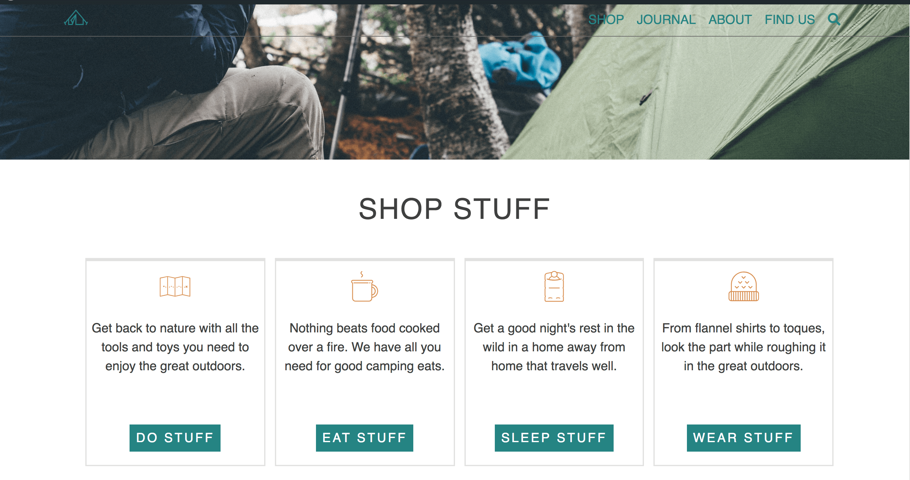

# Inhibatent Prject in WordPress
 #### screen shot of Inhibatent

## Pre-requirements
* Git
* MAMP
* VS Code
* WordPress Installation
  * inhabitent-business-hours (plugin)
  * inhabitent Functionality (plugin)
  * Gutenberg (plugin)
* Red Start Theme

## Language & Technology
* PHP
* HTML
* JQUERY
* CSS/SCSS
* JAVASCRIPT
* WordPress Function 
  * add_filter
  * add_action
* Custom Page Templates 
* Functionality Plugins
* Custom Taxonomies
* Custom Post Loops
 * query_posts()
 * WP_Query
 * get_posts()
 ## Contributing Links
 * https://generatewp.com/taxonomy/
 * https://codex.wordpress.org/Widgets_API
 * https://developer.wordpress.org/reference/functions/add_action/

## Authors  
  * Felix 

## Acknowledgments
* Ben
* Jim
## License
* This project is licensed under the RED License   

